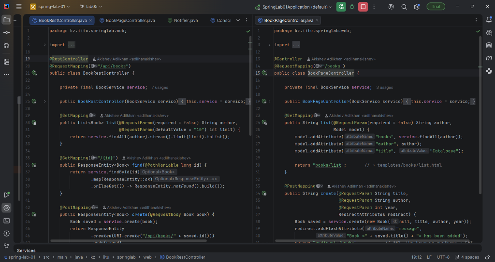
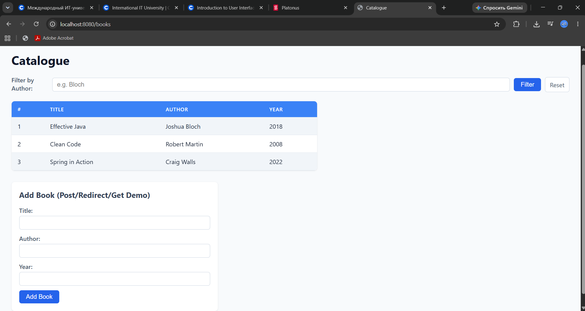
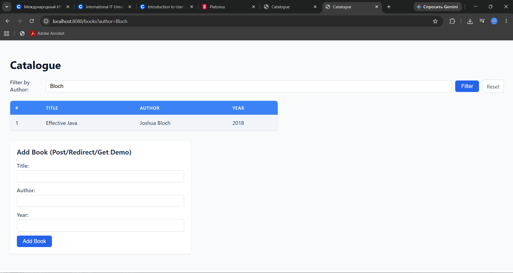
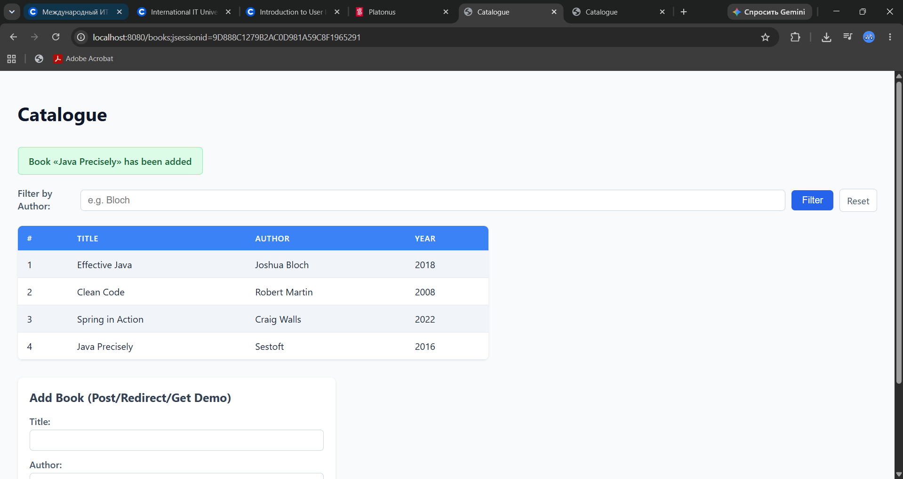
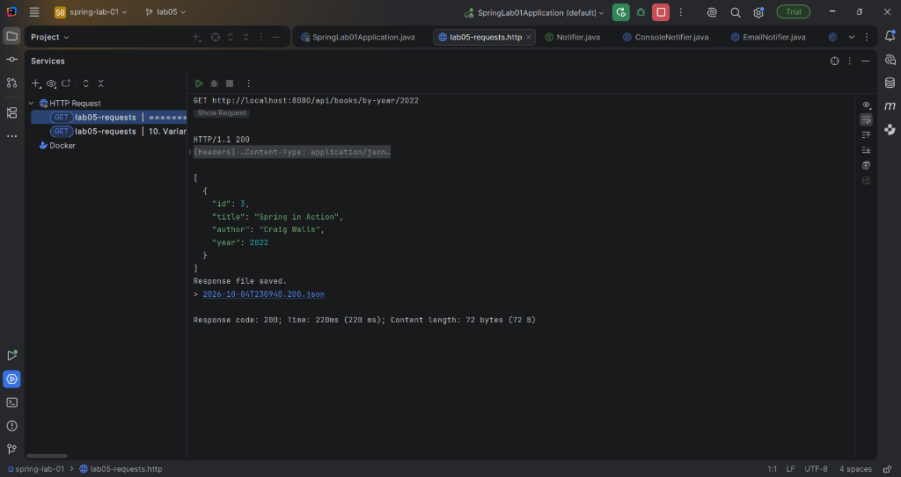
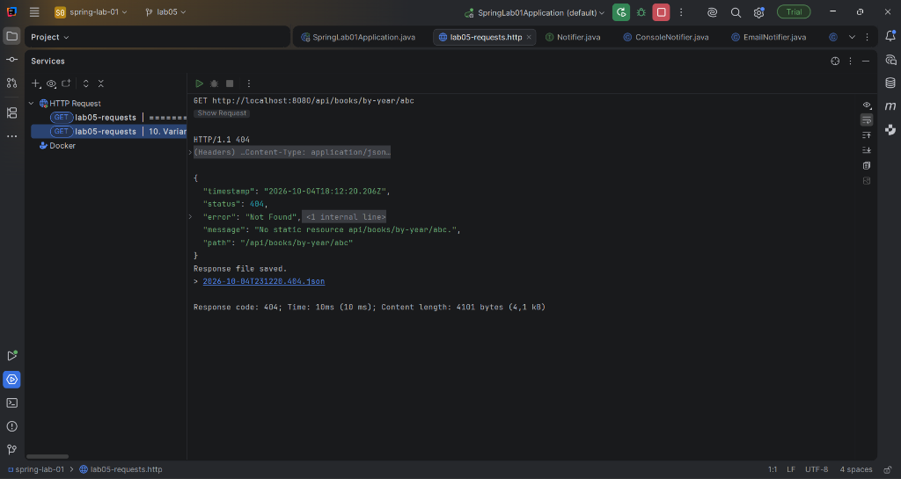
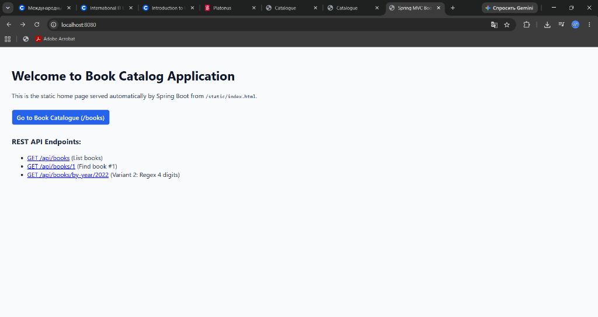
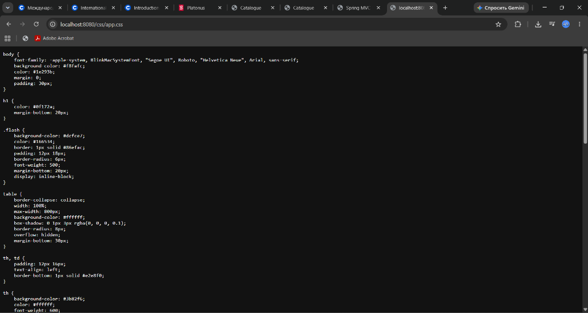
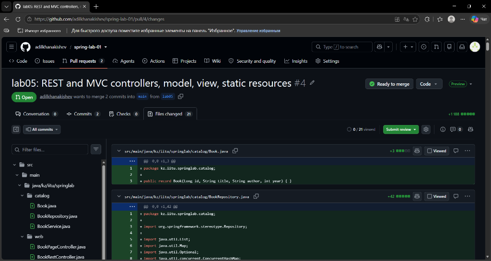

# JSC «INTERNATIONAL INFORMATION TECHNOLOGY UNIVERSITY»
### Faculty of Business, Media and Management · Department of Information Systems
### LABORATORY WORK No. 5
**Topic:** Developing a web application with Spring MVC: controllers, routing, request parameters, passing data to the view, static resources  
**Course:** RWPSF 3305 — Web Application Development with Spring Framework  
**Educational Programme:** 6B06105 — Information Systems, year 3, semester 6  
**Student:** Akishev Adilkhan  
**Group:** IS-2406 (2406IS)  
**Variant:** 2 (`GET /api/books/by-year/{year}` constrained by regex `\d{4}`)  
**Lecturer:** Yemberdiyeva Aknur, Senior Lector  
**Branch:** `lab05`  
**Repository:** https://github.com/adilkhanakishev/spring-lab-01  
**Pull Request:** https://github.com/adilkhanakishev/spring-lab-01/pull/4  

---

## 1. Aim of the Work
To build a fully functioning, idiomatic web layer on Spring MVC:
1. Declare and contrast both controller types: `@RestController` (REST API with `@ResponseBody` and `HttpMessageConverter`) and `@Controller` (MVC server-side rendering with `Model` and `ViewResolver`).
2. Map all parts of HTTP requests (`@PathVariable`, `@RequestParam`, `@RequestBody`, `@RequestHeader`) into strongly-typed Java method parameters.
3. Manage HTTP response status codes using `ResponseEntity` (200 OK, 201 Created with `Location` header, 204 No Content, 404 Not Found).
4. Serve static resources (CSS stylesheet, HTML landing page) from standard classpath directories without custom controller mappings.
5. Implement the Post/Redirect/Get (PRG) pattern with `RedirectAttributes` flash attributes to prevent duplicate form submissions upon browser refresh.
6. Reproduce, diagnose, and explain five distinct HTTP error responses: 400 Bad Request, 404 Not Found, 405 Method Not Allowed, 415 Unsupported Media Type, and 406 Not Acceptable.
7. Complete individual variant 2: routing regex-constrained path variables (`GET /api/books/by-year/{year:\d{4}}`).

---

## 2. Architecture and Package Structure
```
src/main/java/kz/iitu/springlab/
├── catalog/
│   ├── Book.java                # Domain record (id, title, author, year)
│   ├── BookRepository.java      # In-memory repository (ConcurrentHashMap, AtomicLong)
│   └── BookService.java         # Catalog service with filtering & variant methods
├── web/
│   ├── BookRestController.java  # REST API controller (/api/books)
│   └── BookPageController.java  # MVC Web Controller (/books with PRG)
└── SpringLab01Application.java  # Main Spring Boot application entry point

src/main/resources/
├── static/
│   ├── css/app.css              # Custom table and flash message styles
│   └── index.html               # Welcome page served from root (/)
└── templates/
    └── books/
        └── list.html            # Thymeleaf template with th:text, th:each, th:if

lab05-requests.http              # IntelliJ IDEA HTTP Client scratch file for instant execution
```


*Figure 1: Side-by-side view of BookRestController (@RestController) and BookPageController (@Controller) in IntelliJ IDEA*

---

## 3. Core Listings

### Listing 1: Domain Record & Repository (`Book.java` & `BookRepository.java`)
```java
package kz.iitu.springlab.catalog;

public record Book(Long id, String title, String author, int year) { }
```

```java
package kz.iitu.springlab.catalog;

import org.springframework.stereotype.Repository;

import java.util.List;
import java.util.Map;
import java.util.Optional;
import java.util.concurrent.ConcurrentHashMap;
import java.util.concurrent.atomic.AtomicLong;

@Repository
public class BookRepository {
    private final Map<Long, Book> storage = new ConcurrentHashMap<>();
    private final AtomicLong sequence = new AtomicLong();

    public BookRepository() {
        save(new Book(null, "Effective Java", "Joshua Bloch", 2018));
        save(new Book(null, "Clean Code", "Robert Martin", 2008));
        save(new Book(null, "Spring in Action", "Craig Walls", 2022));
    }

    public List<Book> findAll() {
        return List.copyOf(storage.values());
    }

    public Optional<Book> findById(long id) {
        return Optional.ofNullable(storage.get(id));
    }

    public Book save(Book book) {
        long id = book.id() != null ? book.id() : sequence.incrementAndGet();
        Book stored = new Book(id, book.title(), book.author(), book.year());
        storage.put(id, stored);
        return stored;
    }

    public boolean deleteById(long id) {
        return storage.remove(id) != null;
    }
}
```

### Listing 2: Service Layer (`BookService.java`)
```java
package kz.iitu.springlab.catalog;

import org.springframework.stereotype.Service;

import java.util.List;
import java.util.Optional;

@Service
public class BookService {
    private final BookRepository repository;

    public BookService(BookRepository repository) {
        this.repository = repository;
    }

    public List<Book> findAll(String author) {
        if (author == null || author.isBlank()) {
            return repository.findAll();
        }
        return repository.findAll().stream()
                .filter(book -> book.author() != null && 
                                book.author().toLowerCase().contains(author.toLowerCase().trim()))
                .toList();
    }

    public Optional<Book> findById(long id) {
        return repository.findById(id);
    }

    public Book create(Book book) {
        return repository.save(book);
    }

    public Optional<Book> update(long id, Book book) {
        if (repository.findById(id).isEmpty()) {
            return Optional.empty();
        }
        Book updated = new Book(id, book.title(), book.author(), book.year());
        return Optional.of(repository.save(updated));
    }

    public boolean delete(long id) {
        return repository.deleteById(id);
    }

    public List<Book> findByYear(int year) {
        return repository.findAll().stream()
                .filter(book -> book.year() == year)
                .toList();
    }
}
```

### Listing 3: REST Controller (`BookRestController.java`)
```java
package kz.iitu.springlab.web;

import kz.iitu.springlab.catalog.Book;
import kz.iitu.springlab.catalog.BookService;
import org.springframework.http.ResponseEntity;
import org.springframework.web.bind.annotation.*;

import java.net.URI;
import java.util.List;

@RestController
@RequestMapping("/api/books")
public class BookRestController {

    private final BookService service;

    public BookRestController(BookService service) {
        this.service = service;
    }

    @GetMapping
    public List<Book> list(@RequestParam(required = false) String author,
                           @RequestParam(defaultValue = "10") int limit) {
        return service.findAll(author).stream().limit(limit).toList();
    }

    @GetMapping("/{id}")
    public ResponseEntity<Book> find(@PathVariable long id) {
        return service.findById(id)
                .map(ResponseEntity::ok)
                .orElseGet(() -> ResponseEntity.notFound().build());
    }

    @PostMapping
    public ResponseEntity<Book> create(@RequestBody Book book) {
        Book saved = service.create(book);
        return ResponseEntity
                .created(URI.create("/api/books/" + saved.id()))
                .body(saved);
    }

    @PutMapping("/{id}")
    public ResponseEntity<Book> update(@PathVariable long id, @RequestBody Book book) {
        return service.update(id, book)
                .map(ResponseEntity::ok)
                .orElseGet(() -> ResponseEntity.notFound().build());
    }

    @DeleteMapping("/{id}")
    public ResponseEntity<Void> delete(@PathVariable long id) {
        return service.delete(id)
                ? ResponseEntity.noContent().build()
                : ResponseEntity.notFound().build();
    }

    /**
     * Individual Variant 2:
     * GET /api/books/by-year/{year}
     * A path variable constrained by a regular expression to four digits;
     * a non-matching path must give 404.
     */
    @GetMapping("/by-year/{year:\\d{4}}")
    public List<Book> findByYear(@PathVariable int year) {
        return service.findByYear(year);
    }
}
```

### Listing 4: MVC Page Controller (`BookPageController.java`)
```java
package kz.iitu.springlab.web;

import kz.iitu.springlab.catalog.Book;
import kz.iitu.springlab.catalog.BookService;
import org.springframework.stereotype.Controller;
import org.springframework.ui.Model;
import org.springframework.web.bind.annotation.*;
import org.springframework.web.servlet.mvc.support.RedirectAttributes;

@Controller
@RequestMapping("/books")
public class BookPageController {

    private final BookService service;

    public BookPageController(BookService service) {
        this.service = service;
    }

    @GetMapping
    public String list(@RequestParam(required = false) String author,
                       Model model) {
        model.addAttribute("books", service.findAll(author));
        model.addAttribute("author", author);
        model.addAttribute("title", "Catalogue");

        return "books/list";       // Resolves to templates/books/list.html
    }

    @PostMapping
    public String create(@RequestParam String title,
                         @RequestParam String author,
                         @RequestParam int year,
                         RedirectAttributes redirect) {
        Book saved = service.create(new Book(null, title, author, year));
        redirect.addFlashAttribute("message",
                "Book «" + saved.title() + "» has been added");
        return "redirect:/books";  // 302 Redirect; browser performs GET
    }
}
```

---

## 4. Five REST Operations Verification Table

| Operation | HTTP Request | Status | Response Payload / Headers |
| :--- | :--- | :---: | :--- |
| **List books** | `GET /api/books` | **200 OK** | `[{"id":1,"title":"Effective Java",...}, {"id":2,...}, {"id":3,...}]` |
| **Filter & limit** | `GET /api/books?author=Bloch&limit=1` | **200 OK** | `[{"id":1,"title":"Effective Java","author":"Joshua Bloch","year":2018}]` |
| **Read existing** | `GET /api/books/1` | **200 OK** | `{"id":1,"title":"Effective Java","author":"Joshua Bloch","year":2018}` |
| **Read missing** | `GET /api/books/999` | **404 Not Found** | Empty body (`ResponseEntity.notFound().build()`) |
| **Create record** | `POST /api/books` <br> `Content-Type: application/json` <br> `{"title":"Pro Spring 6","author":"Cosmina","year":2023}` | **201 Created** | `Location: /api/books/4` <br> `{"id":4,"title":"Pro Spring 6","author":"Cosmina","year":2023}` |
| **Delete twice** | `DELETE /api/books/2` (1st call) <br> `DELETE /api/books/2` (2nd call) | **204 No Content** <br> **404 Not Found** | 1st call: empty body, entity removed <br> 2nd call: entity absent, returns 404 |

---

## 5. Web UI, Post/Redirect/Get, and Static Resources


*Figure 2: Catalogue page (/books) rendered in browser with CSS stylesheet*


*Figure 3: Catalogue page filtered by author (/books?author=Bloch)*


*Figure 4: Flash message displayed after POST submission using Post/Redirect/Get (session cookie attached)*

### Post/Redirect/Get Demonstration Analysis:
1. **Form Submission:** Browser executes `POST /books` with form body `title=Java Precisely&author=Sestoft&year=2016`.
2. **Controller Processing:** `BookPageController.create(...)` invokes `service.create(...)`, attaches flash attribute `"message"`, and returns `"redirect:/books"`.
3. **Response:** Spring MVC returns `302 Found`, with `Location: /books` and `Set-Cookie: JSESSIONID=...`.
4. **Follow-up Request:** Browser issues `GET /books` carrying the session cookie.
5. **Flash Retrieval:** DispatcherServlet moves the flash attribute from the session into the request `Model` and immediately removes it from the session. The template renders the green flash banner: `Book «Java Precisely» has been added`.
6. **Refresh (F5):** Pressing F5 re-sends `GET /books`. Because the flash message was already removed from the session during step 5, no flash banner appears, and no duplicate entity is created.

---

## 6. HTTP Status Code Experiments Table (Task 4.3)

| What you send | Status | Why exactly this status (Mapping & Dispatch Analysis) |
| :--- | :---: | :--- |
| `GET /api/books/abc` | **400 Bad Request** | The route `@GetMapping("/{id}")` matched, but argument binding failed: `"abc"` cannot be parsed into `long` by Spring's `ConversionService`. Spring throws `MethodArgumentTypeMismatchException` and returns 400 before invoking the method. |
| `GET /api/nothing` | **404 Not Found** | `DispatcherServlet` queried all registered `HandlerMapping` components. No controller or static resource handler matched `/api/nothing`. Delegated to `NoResourceFoundException`, yielding 404. |
| `DELETE /api/books` (no ID) | **405 Method Not Allowed** | Path `/api/books` exists in `RequestMappingInfoHandlerMapping`, but only maps `GET` and `POST`. Because `DELETE` is unsupported on the collection URI, Spring returns 405 with `Allow: POST, GET`. |
| `POST /api/books` (`Content-Type: text/plain`) | **415 Unsupported Media Type** | `@RequestBody Book` requires a compatible `HttpMessageConverter`. `MappingJackson2HttpMessageConverter` only accepts `application/json`. `text/plain` is rejected with `HttpMediaTypeNotSupportedException`. |
| `GET /api/books` (`Accept: application/xml`) | **406 Not Acceptable** | The client requests XML (`Accept: application/xml`), but the server only has Jackson JSON configured on the classpath (no `jackson-dataformat-xml`). Spring throws `HttpMediaTypeNotAcceptableException`. |

---

## 7. Individual Assignment: Variant 2
- **Endpoint:** `GET /api/books/by-year/{year}`
- **Requirement:** Path variable constrained by a regular expression to four digits; a non-matching path must give 404.
- **Mapping:** `@GetMapping("/by-year/{year:\\d{4}}")`
- **Verification via IntelliJ IDEA HTTP Client:**
  - `GET /api/books/by-year/2022` &rarr; **200 OK**, `[{"id":3,"title":"Spring in Action","author":"Craig Walls","year":2022}]`.
  - `GET /api/books/by-year/abc` &rarr; **404 Not Found** (Regex `\d{4}` does not match, so `HandlerMapping` skips this handler and returns 404).


*Figure 5: Variant 2 valid request (/by-year/2022) returning 200 OK in IntelliJ IDEA HTTP Client*


*Figure 6: Variant 2 invalid request (/by-year/abc) returning 404 Not Found due to regex mismatch in IntelliJ IDEA HTTP Client*

---

## 8. Static Resources Resolution
- `/css/app.css` and `/` (`index.html`) answer with 200 OK without controller mappings because Spring Boot registers `ResourceHttpRequestHandler` mapped to `/**`, resolving files from `classpath:/static/`.
- Root `/` is mapped by `WelcomePageHandlerMapping` to `classpath:/static/index.html`.


*Figure 7: Static start page (/index.html) rendered from classpath:/static/index.html*


*Figure 8: Static stylesheet (/css/app.css) served directly by ResourceHttpRequestHandler*

---

## 9. Source Code Repository and Pull Request Verification
All source code, configuration files, templates, stylesheets, tests, and documentation are committed and pushed to the official GitHub repository for the course:
- **Repository URL:** https://github.com/adilkhanakishev/spring-lab-01
- **Work Branch:** `lab05`
- **Official Pull Request:** https://github.com/adilkhanakishev/spring-lab-01/pull/4

The pull request compares branch `lab05` against base branch `main` and contains all 21 changed files.


*Figure 9: Official GitHub Pull Request #4 (lab05 -> main) with all 21 modified files and commit history*

---

## 10. Conclusions
1. The Front Controller pattern via `DispatcherServlet` centralizes request parsing, routing, and error handling, isolating controllers from low-level Servlet API concerns.
2. The architectural split between `@RestController` and `@Controller` provides a clear separation of concerns between API serialization and HTML view rendering.
3. Using `ResponseEntity` allows semantic compliance with REST guidelines (Location headers, 201 Created, 204 No Content).
4. The Post/Redirect/Get pattern prevents duplicate form submissions upon browser refresh.

---

## 11. Demonstration Checklist & Defence Questions (Q&A)

### Q1: Trace the path of a request from the browser to your method and back.
Browser &rarr; Tomcat &rarr; `DispatcherServlet` &rarr; `HandlerMapping` (finds controller method) &rarr; `HandlerAdapter` (resolves parameters with `ConversionService`/`HttpMessageConverter`) &rarr; Controller method invocation &rarr; Return value:
- `@RestController`: `RequestResponseBodyMethodProcessor` serializes to JSON via Jackson &rarr; Response body.
- `@Controller`: `ThymeleafViewResolver` renders template with `Model` &rarr; HTML response body.

### Q2: What does HandlerMapping do and what does HandlerAdapter do?
- **HandlerMapping:** Maps an incoming HTTP request (URL, method, headers) to a target `HandlerExecutionChain` (the controller method + interceptors).
- **HandlerAdapter:** Executes the handler method identified by HandlerMapping, resolving method arguments and processing return values.

### Q3: What exactly does @ResponseBody change? Where is it in your code?
`@ResponseBody` tells Spring MVC that the method's return value should be written directly to the HTTP response body via an `HttpMessageConverter`, bypassing view resolution. It is implicitly present on `BookRestController` via `@RestController` (which is a meta-annotation composed of `@Controller` and `@ResponseBody`).

### Q4: Which part of the request does each parameter of your list method come from?
In `list(@RequestParam(required = false) String author, @RequestParam(defaultValue = "10") int limit)`: both parameters are read from the URL query string (`?author=...&limit=...`).

### Q5: What happens if ?limit= is given a value that is not a number, and why is your method not called?
`HandlerAdapter` invokes `ConversionService` to convert the string to an `int`. When conversion fails, `MethodArgumentTypeMismatchException` is thrown and handled by `DefaultHandlerExceptionResolver`, returning **400 Bad Request** before the controller method is called.

### Q6: Why does @RequestParam(required = false) behave differently from a @RequestParam without attributes?
By default `required = true`. If omitted, Spring throws `MissingServletRequestParameterException` (400 Bad Request). With `required = false`, Spring passes `null`.

### Q7: Why does the creation return 201 and not 200? What is in the Location header?
HTTP 201 Created signifies that a new resource has been created. The `Location` header provides the URI of the newly created resource (`/api/books/4`).

### Q8: Why does the second DELETE of the same identifier return 404?
The first `DELETE` removes the book from `storage`, returning `true` &rarr; **204 No Content**. The second `DELETE` finds no entity (`remove(id)` is null) &rarr; returns `false` &rarr; **404 Not Found**.

### Q9: What is the model in your page controller? Who fills it in and who reads it?
The `Model` is a data holder for view rendering. `BookPageController` populates it with `model.addAttribute(...)`. Thymeleaf reads it during template evaluation.

### Q10: How does the name books/list become a file? Which component decides that?
`ThymeleafViewResolver` appends the prefix `classpath:/templates/` and suffix `.html` to `"books/list"`, locating `src/main/resources/templates/books/list.html`.

### Q11: Why is /css/app.css served although no controller maps it?
Spring Boot auto-configures `ResourceHttpRequestHandler` mapped to `/**`, which looks up static files in `classpath:/static/`.

### Q12: How many requests does the browser make in your Post/Redirect/Get, and what is the status of each?
Two requests:
1. `POST /books` &rarr; **302 Found** (redirect to `/books`).
2. `GET /books` &rarr; **200 OK** (renders list).

### Q13: Where is the flash message stored between the two requests, and who removes it?
Stored in the server HTTP session (`FlashMap`). `DispatcherServlet` transfers it to the `Model` on the next GET request and purges it from the session.

### Q14: For each row of your status-code table: which part of the mapping did not match?
- **400:** Path matched, parameter type conversion failed.
- **404:** No URL path mapping found.
- **405:** URL path matched, HTTP method was not in allowed methods.
- **415:** URL and method matched, `Content-Type` header was unsupported.
- **406:** URL and method matched, `Accept` header could not be satisfied.

### Q15: Why is 415 returned for Content-Type: text/plain and 406 for Accept: application/xml?
- **415:** Server cannot parse the incoming request body (`text/plain`).
- **406:** Server cannot format the response into the requested representation (`application/xml`).

### Q16: What would change in your controllers if the template engine were replaced?
Nothing. The controller returns a logical view name (`"books/list"`) and populates a generic `Model`. Only `pom.xml` and template files would change.
